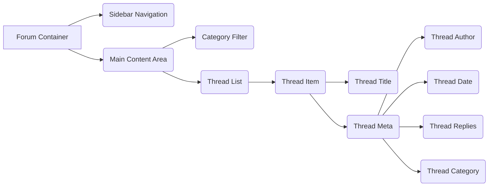

# Forum Improvement Plan

## I. Analysis of Current Forum Structure:

*   **File Structure:**
    *   `server/views/forum/index.handlebars`: Displays the main forum page with category links and recent threads.
    *   `server/views/forum/category.handlebars`: Displays threads within a specific category.
    *   `server/views/forum/thread.handlebars`: Displays a specific thread with its original post and replies.
    *   `server/views/forum/new-thread.handlebars`: Form for creating a new thread.
    *   `public/css/styles.css`: Contains general website styling and some basic forum styling.
    *   `public/css/laincore.css`: Defines the core "cyberschizo" aesthetic.
    *   `public/js/main.js`: Contains JavaScript functionality for the website, including UI elements and effects.
*   **Visual Design:**
    *   The forum uses "cyber-window" elements for categories and threads, with a dark color scheme and green text.
    *   Typography is based on the 'Syne Mono' monospace font.
    *   The design incorporates some glitch effects and scanlines.
*   **Navigation:**
    *   The main forum page (`index.handlebars`) provides links to different categories.
    *   Category pages (`category.handlebars`) display a list of threads with breadcrumbs for navigation.
    *   Thread pages (`thread.handlebars`) show the original post and replies.
*   **UI Components:**
    *   "cyber-button" elements are used for actions like creating a new thread or logging in.
    *   The "new-thread.handlebars" form includes input fields for the thread title, category, content, and tags.
*   **Backend:**
    *   The forum uses Handlebars templates for rendering dynamic content.
    *   The `isAuthenticated` helper is used to conditionally display login/post options.
    *   The "new-thread.handlebars" form submits data to the `/forum/new` endpoint.

## II. Detailed Design Recommendations:

*   **Enhanced Visual Design:**
    *   **Color Palette:** Emphasize the dark purple on black/grey on black color scheme. Use `#120124` as the primary background color, with `#211A29` for secondary elements.
    *   **Typography:** Maintain the 'Syne Mono' monospace font for headers and body text. Use a smaller font size (e.g., 0.8rem) for metadata and labels.
    *   **Glitch Effects:** Add more prominent glitch effects to headers, buttons, and window borders. Use CSS animations to create subtle, randomized glitches.
    *   **CRT-Style Visuals:** Enhance the CRT effect with scanlines, flicker, and slight blurring. Consider adding a subtle vignette effect to the forum container.
    *   **Terminal-Inspired Elements:** Incorporate elements from the terminal interface, such as a blinking cursor, command prompts, and green monospaced text.
*   **Improved Navigation Structure:**
    *   **Sidebar Navigation:** Implement a fixed sidebar navigation using the existing `.cyber-nav` component. Include links to the main forum page, category pages, and a "New Thread" button.
    *   **Breadcrumbs:** Improve the breadcrumbs component with a more visually distinct style. Use a separator character (e.g., "»") and highlight the current page.
    *   **Category Filtering:** Add a category filter to the main forum page, allowing users to quickly navigate to specific categories.
*   **Clear UI Components:**
    *   **Thread List:** Redesign the thread list with a more compact and informative layout. Include the thread title, author, date, reply count, and category.
    *   **Post Display:** Improve the post display with clear separation between the author information and the post content. Use a distinct background color for each post.
    *   **Reply Form:** Enhance the reply form with a WYSIWYG editor that supports basic formatting (bold, italic, links, code blocks).
    *   **New Thread Form:** Streamline the new thread form with a more intuitive layout and clear labels. Add a character counter for the title and content fields.
*   **Responsive Design Considerations:**
    *   Use media queries to adjust the layout and font sizes for different screen sizes.
    *   Optimize the sidebar navigation for mobile devices by collapsing it into a hamburger menu.
    *   Ensure that all UI components are touch-friendly and easy to use on mobile devices.
*   **Backend Changes:**
    *   Implement proper thread pagination to handle a large number of threads.
    *   Add support for user avatars and profile links.
    *   Implement a system for displaying the number of replies and views for each thread.
    *   Add support for thread tagging and searching.
    *   Implement a notification system for new replies and mentions.

## III. Suggested Layout Improvements with Wireframe Descriptions:

*   **Sidebar Navigation:** A fixed sidebar on the left side of the page, containing links to the main forum page, category pages, and a "New Thread" button.
*   **Category Filter:** A dropdown menu or a set of tabs at the top of the main content area, allowing users to filter threads by category.
*   **Thread List:** A list of threads, displayed in a compact and informative layout. Each thread item should include the thread title, author, date, reply count, and category.
*   **Post Display:** The original post and replies should be displayed in a clear and visually distinct manner. The author information should be separated from the post content.
*   **Reply Form:** A WYSIWYG editor should be used for the reply form, allowing users to format their text with bold, italic, links, and code blocks.

## IV. List of Files That Will Need to Be Modified:

*   `server/views/forum/index.handlebars`
*   `server/views/forum/category.handlebars`
*   `server/views/forum/thread.handlebars`
*   `server/views/forum/new-thread.handlebars`
*   `public/css/styles.css`
*   `public/css/laincore.css`
*   `public/js/main.js`
*   Potentially new CSS and JS files for specific forum functionality.