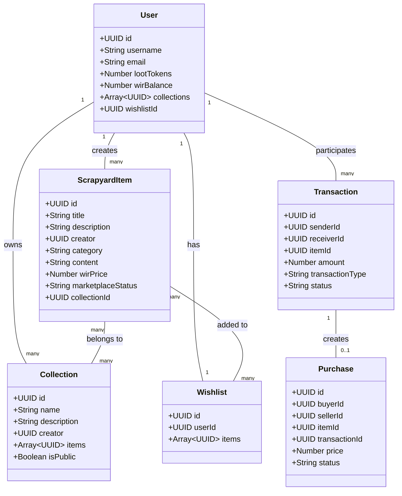
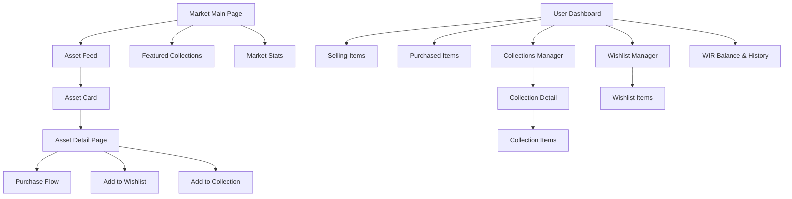

# Architecture Plan for The Vivid Market

## 1. Overview

The Vivid Market will be a digital asset marketplace that replaces the existing nullspace section. It will:
- Extend the existing loot tokens system to create WIR virtual currency
- Leverage the Scrapyard functionality for asset uploads
- Maintain the current Win98/Web 1.0 aesthetic
- Implement user-driven asset feeds with filtering
- Add collections and wishlist systems

## 2. Database Schema Extensions

### 2.1 Asset/Marketplace Items

We'll extend the existing `ScrapyardItem` model with additional fields:

```javascript
// New fields to add to ScrapyardItem
{
  wir_price: Number,          // Price in WIR currency
  marketplace_status: String, // "available", "sold", "reserved"
  collection_id: UUID,        // Reference to collection (optional)
  views: Number,              // Track views for popularity metrics
  featured_in_market: Boolean // Featured in Vivid Market specifically
}
```

### 2.2 Collections

New `Collection` model:

```javascript
{
  id: UUID,
  name: String,
  description: String,
  creator: UUID,           // Reference to User
  items: Array<UUID>,      // References to ScrapyardItems
  cover_image: String,     // Path to cover image
  is_public: Boolean,      // Whether collection is public
  created_at: Timestamp,
  updated_at: Timestamp
}
```

### 2.3 Wishlists

New `Wishlist` model:

```javascript
{
  id: UUID,
  user_id: UUID,           // Reference to User
  items: Array<UUID>,      // References to ScrapyardItems
  created_at: Timestamp,
  updated_at: Timestamp
}
```

### 2.4 WIR Transactions

New `Transaction` model:

```javascript
{
  id: UUID,
  sender_id: UUID,         // Reference to User
  receiver_id: UUID,       // Reference to User
  item_id: UUID,           // Reference to ScrapyardItem (optional)
  amount: Number,          // Amount of WIR
  transaction_type: String, // "purchase", "transfer", "reward", etc.
  status: String,          // "pending", "completed", "failed"
  created_at: Timestamp
}
```

### 2.5 Purchases

New `Purchase` model:

```javascript
{
  id: UUID,
  buyer_id: UUID,          // Reference to User
  seller_id: UUID,         // Reference to User
  item_id: UUID,           // Reference to ScrapyardItem
  transaction_id: UUID,    // Reference to Transaction
  price: Number,           // Price in WIR
  status: String,          // "completed", "disputed", "refunded"
  created_at: Timestamp
}
```

### 2.6 User Model Extensions

Extend the existing `User` model:

```javascript
// New fields to add to User
{
  wir_balance: Number,     // Balance of WIR currency
  wir_transactions: Array<UUID>, // References to Transactions
  collections: Array<UUID>, // References to Collections
  wishlist_id: UUID,       // Reference to Wishlist
  selling_items: Array<UUID>, // References to ScrapyardItems being sold
  purchased_items: Array<UUID> // References to ScrapyardItems purchased
}
```

## 3. Integration Points with Existing Systems

### 3.1 User Authentication

- Leverage existing Passport.js authentication
- Add middleware to check WIR balance for purchases
- Add transaction verification middleware

### 3.2 Asset Upload System

- Extend the existing Scrapyard upload functionality
- Add marketplace-specific metadata fields
- Implement WIR pricing during upload

### 3.3 Loot Tokens to WIR Conversion

- Add conversion mechanism between loot tokens and WIR
- Implement exchange rate system (configurable by admin)
- Add transaction history for conversions

## 4. Routes and API Endpoints

### 4.1 Market Routes

```
GET /market                     - Main marketplace view
GET /market/browse              - Browse all items with filtering
GET /market/item/:id            - View specific item
POST /market/item/:id/purchase  - Purchase an item
GET /market/collections         - View all public collections
GET /market/collections/:id     - View specific collection
```

### 4.2 User Market Routes

```
GET /market/user/selling        - View items user is selling
GET /market/user/purchased      - View items user has purchased
GET /market/user/collections    - View user's collections
GET /market/user/wishlist       - View user's wishlist
```

### 4.3 Collection Routes

```
POST /market/collections/create           - Create a new collection
PUT /market/collections/:id               - Update a collection
DELETE /market/collections/:id            - Delete a collection
POST /market/collections/:id/add/:itemId  - Add item to collection
DELETE /market/collections/:id/remove/:itemId - Remove item from collection
```

### 4.4 Wishlist Routes

```
POST /market/wishlist/add/:itemId     - Add item to wishlist
DELETE /market/wishlist/remove/:itemId - Remove item from wishlist
```

### 4.5 WIR Transaction Routes

```
POST /market/wir/transfer       - Transfer WIR to another user
GET /market/wir/transactions    - View transaction history
POST /market/wir/convert        - Convert loot tokens to WIR
```

### 4.6 API Endpoints

```
GET /api/market/items           - Get marketplace items (with filtering)
GET /api/market/collections     - Get collections
GET /api/market/trending        - Get trending items
GET /api/market/user/:id/selling - Get items user is selling
GET /api/market/wir/rate        - Get current exchange rate
```

## 5. Component Architecture

### 5.1 Database Layer



### 5.2 Frontend Components



## 6. Implementation Strategy

### 6.1 Phase 1: Database Schema Updates

1. Extend the `User` model with WIR-related fields
2. Extend the `ScrapyardItem` model with marketplace fields
3. Create new models: `Collection`, `Wishlist`, `Transaction`, `Purchase`
4. Set up database migrations and initial data

### 6.2 Phase 2: Core Marketplace Functionality

1. Implement WIR currency system
2. Create marketplace browsing and filtering
3. Implement purchase flow
4. Add user selling/purchased items views

### 6.3 Phase 3: Collections and Wishlists

1. Implement collections CRUD operations
2. Implement wishlist functionality
3. Add collection browsing and discovery features

### 6.4 Phase 4: UI Implementation

1. Replace nullspace section with Vivid Market in index.html
2. Create marketplace browsing interface
3. Implement asset detail views
4. Add collection and wishlist UI components

### 6.5 Phase 5: Testing and Optimization

1. Test all marketplace flows
2. Optimize database queries
3. Implement caching for popular items and collections
4. Performance testing and optimization

## 7. Technical Recommendations

1. **Optimistic UI Updates**: Implement optimistic UI updates for better user experience during transactions
2. **Pagination and Lazy Loading**: Use pagination and lazy loading for marketplace browsing
3. **Real-time Updates**: Consider using Supabase's real-time capabilities for live marketplace updates
4. **Transaction Atomicity**: Ensure transaction operations are atomic to prevent data inconsistencies
5. **Search Optimization**: Implement efficient search indexing for marketplace items
6. **Caching Strategy**: Cache popular marketplace items and collections

## 8. Security Considerations

1. **Transaction Verification**: Implement robust verification for all WIR transactions
2. **Rate Limiting**: Apply rate limiting to prevent abuse of marketplace APIs
3. **Input Validation**: Thorough validation for all marketplace inputs
4. **Permission Checks**: Strict permission checks for collection and item management
5. **Audit Logging**: Log all marketplace transactions for audit purposes