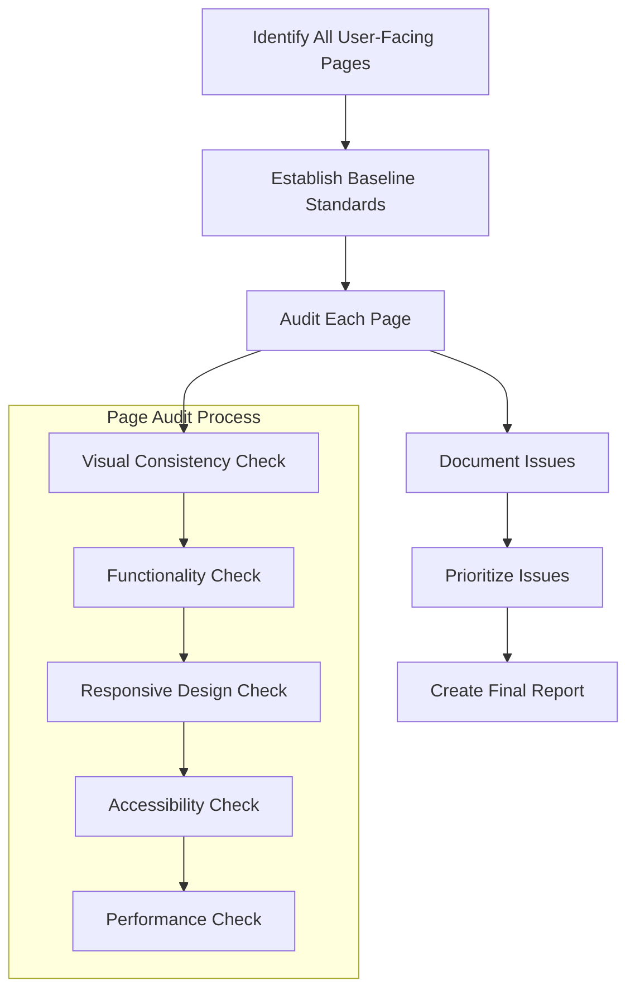
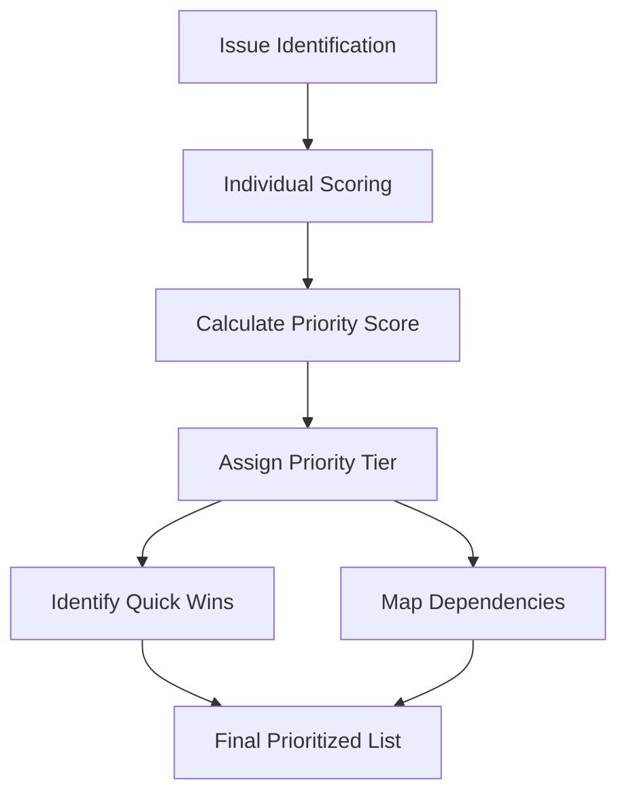
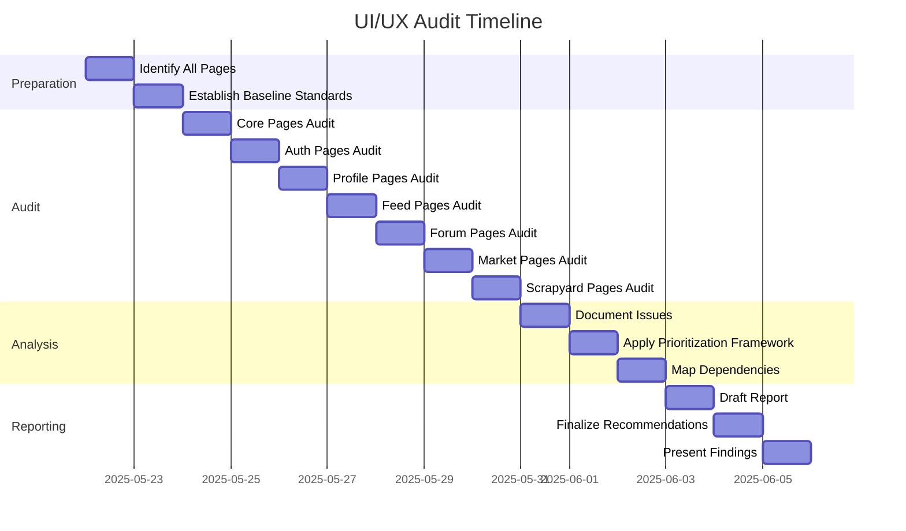

# UI/UX Audit Plan for wirebase.city

## Overview

The wirebase.city project has a cyberpunk/hacker aesthetic with a dark theme. This audit will identify all pages with inconsistent or incomplete styling/functionality compared to the main pages, focusing on:

1. Visual consistency with the main site's cyberpunk aesthetic
2. Functional completeness
3. Responsive design issues
4. Accessibility concerns
5. Performance issues

We already know the user registration/identity creation page has both styling inconsistencies and functional issues.

## Audit Methodology



### Step 1: Identify All User-Facing Pages

Based on the project structure analysis, we'll categorize all user-facing pages:

1. **Core Pages**
   - Home page (`/`)
   - About page (`/about`)
   - Discover feed (`/discover`)
   - FAQ, Privacy, Terms pages

2. **User Authentication**
   - Login page (`/users/login`)
   - Registration page (`/users/register`)
   - Password reset page (`/users/forgot-password`)
   - Account settings (`/users/settings`)

3. **Profile Pages**
   - User profile (`/profile`)
   - Profile viewing (`/profile/:username`)
   - Profile HTML/CSS editing (`/profile/edit/html`, `/profile/edit/css`)
   - Terminal mode (`/profile/terminal`)

4. **Feed Pages**
   - Main feed (`/feed`)
   - Feed subscription (`/feed/subscribe`)
   - User-specific feeds (`/feed/user/:username`)
   - Category-specific feeds (`/feed/scrapyard/:category`)

5. **Forum Pages**
   - Forum home (`/forum`)
   - Category view (`/forum/category/:category`)
   - Thread view (`/forum/thread/:id`)
   - New thread creation (`/forum/new`)

6. **Market Pages**
   - Market home (`/market`)
   - Browse items (`/market/browse`)
   - Item view (`/market/item/:id`)
   - Collections (`/market/collections`, `/market/collections/:id`)
   - Item submission (`/market/submit`)
   - User wishlist (`/market/user/wishlist`)
   - WIR dashboard (`/market/wir`)

7. **Scrapyard Pages**
   - Scrapyard home (`/scrapyard`)
   - Category view (`/scrapyard/category/:category`)
   - Item view (`/scrapyard/item/:id`)
   - Item submission (`/scrapyard/submit`)
   - Search results (`/scrapyard/search`)

### Step 2: Establish Baseline Standards

We'll define baseline standards by examining the main site's high-quality pages:

1. **Visual Standards**
   - Color palette (from cyber-variables.css)
   - Typography (fonts, sizes, weights)
   - UI components (buttons, forms, cards, etc.)
   - Special effects (glitch animations, scanlines, etc.)
   - Layout patterns

2. **Functional Standards**
   - Expected interactive elements
   - Form validation
   - Error handling
   - Loading states
   - User feedback mechanisms

3. **Responsive Design Standards**
   - Breakpoints
   - Mobile adaptations
   - Touch-friendly interfaces

4. **Accessibility Standards**
   - Color contrast
   - Keyboard navigation
   - Screen reader support
   - Focus states

5. **Performance Standards**
   - Load times
   - Animation smoothness
   - Resource usage

### Step 3: Audit Each Page

For each page, we'll conduct a thorough audit using the following process:

1. **Visual Consistency Check**
   - Compare with baseline visual standards
   - Check for missing or inconsistent styling
   - Verify proper implementation of cyberpunk aesthetic
   - Check for proper use of CSS variables

2. **Functionality Check**
   - Test all interactive elements
   - Verify form submissions and validation
   - Check error handling
   - Test user flows

3. **Responsive Design Check**
   - Test at multiple viewport sizes
   - Verify proper layout adaptation
   - Check for overflow issues
   - Test touch interactions

4. **Accessibility Check**
   - Verify proper semantic HTML
   - Check ARIA attributes
   - Test keyboard navigation
   - Verify color contrast

5. **Performance Check**
   - Measure load times
   - Check for unnecessary resource loading
   - Identify performance bottlenecks

### Step 4: Document Issues

For each page with issues, we'll document:

1. Page URL/name
2. Issue category (visual, functional, responsive, accessibility, performance)
3. Issue description
4. Severity (critical, high, medium, low)
5. Recommended fix
6. Reference to baseline standard

## Enhanced Issue Prioritization Framework

The prioritization of identified issues will be a critical component of this audit. We'll use a multi-dimensional scoring system to ensure that the most important issues are addressed first.

### Primary Prioritization Criteria

1. **User Impact Score (1-10)**
   - **High (8-10)**: Issues affecting core user journeys (registration, login, content creation)
   - **Medium (4-7)**: Issues affecting secondary features (profile customization, feed viewing)
   - **Low (1-3)**: Issues affecting tertiary features (settings, help pages)

2. **Visibility Score (1-10)**
   - **High (8-10)**: Issues on landing pages, main navigation, or frequently visited pages
   - **Medium (4-7)**: Issues on secondary pages that users visit occasionally
   - **Low (1-3)**: Issues on rarely visited pages or admin sections

3. **Brand Consistency Score (1-10)**
   - **High (8-10)**: Severe deviations from the cyberpunk aesthetic that break immersion
   - **Medium (4-7)**: Noticeable inconsistencies that don't match the main site's quality
   - **Low (1-3)**: Minor styling differences that don't significantly impact user experience

4. **Functional Severity Score (1-10)**
   - **Critical (9-10)**: Prevents core functionality from working (broken forms, navigation)
   - **High (7-8)**: Significantly impairs functionality but has workarounds
   - **Medium (4-6)**: Causes user friction but doesn't prevent task completion
   - **Low (1-3)**: Minor annoyances or edge cases

5. **Implementation Complexity Score (1-10)**
   - **Simple (1-3)**: Quick CSS fixes or minor HTML adjustments
   - **Moderate (4-7)**: Requires template modifications or JavaScript changes
   - **Complex (8-10)**: Requires architectural changes or backend modifications

### Prioritization Matrix

We'll use a weighted scoring system to calculate a final priority score:

```
Priority Score = (User Impact × 0.3) + (Visibility × 0.25) + (Brand Consistency × 0.2) + (Functional Severity × 0.15) + (10 - Implementation Complexity) × 0.1
```

This formula gives more weight to user impact and visibility while also considering the ease of implementation (inverse of complexity).

### Priority Tiers

Based on the calculated priority scores, issues will be categorized into tiers:

1. **Critical Priority (8.0-10.0)**
   - Must be addressed immediately
   - Severely impacts user experience or brand perception
   - Typically affects high-traffic pages or core user flows

2. **High Priority (6.0-7.9)**
   - Should be addressed in the next development cycle
   - Significantly impacts user experience or brand consistency
   - Affects important user journeys or prominent pages

3. **Medium Priority (4.0-5.9)**
   - Should be scheduled for upcoming work
   - Moderately impacts user experience
   - Affects secondary features or pages

4. **Low Priority (1.0-3.9)**
   - Can be addressed when resources allow
   - Minimal impact on user experience
   - Affects tertiary features or rarely visited pages

### Quick Wins Identification

We'll also flag "quick wins" - issues that have:
- High visibility or user impact
- Low implementation complexity
- Can be fixed independently of other issues

These quick wins will be highlighted in the report as opportunities for immediate improvement with minimal resource investment.

### Dependency Mapping

Some issues may be interconnected or dependent on other fixes. We'll create a dependency map to ensure that:

1. Foundational issues are addressed before dependent ones
2. Related issues can be fixed together for efficiency
3. Critical path dependencies are clearly identified



## Implementation Plan



## Specific Audit Focus Areas

Based on our initial analysis, we'll pay special attention to:

1. **User Authentication Pages**
   - Registration page (known issues)
   - Login page (potential similar issues)
   - Password reset flow

2. **Profile Editing Pages**
   - HTML/CSS editors
   - Terminal mode

3. **Newer Feature Sections**
   - Vivid Market pages
   - Scrapyard pages

4. **Mobile Responsiveness**
   - Navigation elements
   - Form layouts
   - Complex UI components

5. **Accessibility Features**
   - High contrast mode support
   - Keyboard navigation
   - Screen reader compatibility

## Tools and Resources Needed

1. Browser developer tools for inspecting elements and styles
2. Responsive design testing tools
3. Accessibility evaluation tools
4. Performance measurement tools
5. Documentation of the project's design system

## Deliverables

1. **Comprehensive Audit Report**
   - Executive summary
   - Methodology overview
   - Baseline standards documentation
   - Detailed findings by page category
   - Prioritized issue list with scores and rationale
   - Dependency map for related issues

2. **Prioritized Action Plan**
   - Critical issues requiring immediate attention
   - High-priority issues for next development cycle
   - Medium and low-priority backlog items
   - Quick wins for immediate implementation
   - Resource estimates for remediation

3. **Visual Documentation**
   - Screenshots of identified issues
   - Comparative examples showing inconsistencies
   - Mockups or references for recommended fixes

4. **Technical Recommendations**
   - Specific CSS/HTML fixes for visual issues
   - JavaScript solutions for functional problems
   - Responsive design improvements
   - Accessibility enhancements
   - Performance optimizations